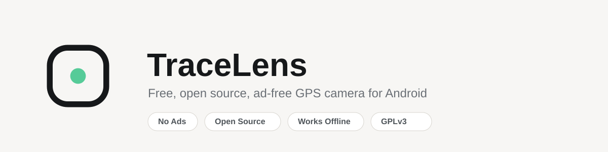

<picture>
  <source media="(prefers-color-scheme: dark)" srcset="assets/banner-dark.svg">
  <source media="(prefers-color-scheme: light)" srcset="assets/banner-light.svg">
  
</picture>

# TraceLens

No ads. No paywall. We know, it's suspicious.

Free, open source, ad free Android camera app that stamps every photo with GPS location, address and timestamp, signs it on-device so anyone can later prove it hasn't been edited, and works fully offline. Built for field surveyors, college students and NGO teams who need to prove where and when a photo was taken, without paying for it or handing over their data.

[](LICENSE)
[](https://developer.android.com)
[](https://github.com/shubham-maker05/Tracelens/actions/workflows/android-ci.yml)
[](#roadmap)

Website: https://shubham-maker05.github.io/Tracelens/

## Why this exists

Most geotagging camera apps on the Play Store make you sit through ads before you can even open the camera, lock basic stamp fields behind a subscription, ask for permissions that have nothing to do with taking a photo, and stop working the moment you lose signal. TraceLens fixes that, in the open, so anyone can read the code and check it for themselves.

## Features

**Capture**
- Clean camera capture built on CameraX, nothing running in the background that shouldn't be
- GPS coordinates, address and timestamp stamped directly onto the photo
- GPS data also written into the photo's own EXIF metadata, so GIS and photo tools pick it up automatically
- Every capture is published straight to your phone's Photos/Gallery app (Pictures/TraceLens), nothing leaves your phone unless you choose to share it

**Built to actually work in the field**
- Offline first reverse geocoding, addresses are cached on-device so the stamp keeps working with no signal
- Every capture fetches a fresh location instead of reusing a stale cached one
- Only camera and location are requested on Android 10+; Android 9 and older also needs storage access to save into the gallery, nothing else, ever

**Made for your organization**
- Choose exactly which fields show on the stamp: coordinates, address, timestamp, altitude, accuracy, compass bearing
- Add your college, company or project name to the stamp, free, no paywall

**Trust and verification**
- Every photo is SHA-256 hashed and signed on-device using a key generated in the Android Keystore, so you can later prove it hasn't been edited since capture
- Field workers can add a signature directly onto the photo before saving, useful for inspection reports and muster-roll style documentation

**No ads, no tracking, ever**
- No ad SDKs, no analytics SDKs, no hidden network calls
- No account, no cloud sync, no server collecting anything, because there is no server

## Tech stack

- Kotlin, Jetpack Compose
- CameraX for capture
- Fused Location Provider for GPS
- Android's built-in Geocoder for reverse geocoding (no third party API key)
- Room for local storage
- Android Keystore for on-device photo signing
- Material 3

## Project status

Version 1.0.0 shipped with everything listed under Features above. 1.1.0 is a full redesign, not a feature bolt-on: a real design system (new brand mark, a proper stamp with a card and a map thumbnail instead of bare text floating on the photo), a live preview of the stamp right in the viewfinder before you shoot, a share button, real camera controls (flash, zoom, grid, timer), and a way to verify a photo someone else sends you, not just the one you captured yourself. Details below and in the roadmap.

## Roadmap

**1.1.0, in design**
- Redesigned stamp: card background, real hierarchy, an optional map thumbnail (OpenStreetMap only, never Google Maps, so the app stays offline-first with no API key)
- Live, accurate stamp preview inside the viewfinder itself, not a guess you check after the fact
- Share straight from the app, right after capture and from the gallery
- Real camera controls: flash, front/back switch, zoom, grid, aspect ratio, timer, tap-to-focus
- Verify a photo someone else sent you, even if it was never captured on your device
- Organization logo image on the stamp, not just text
- A considered first-run screen that explains the two permissions before Android asks

**Later**
- Video geotagging
- Project and site folders to organize captures
- Batch export to PDF report
- CSV, KML and GeoJSON export for GIS workflows
- Voice notes attached to photos
- Before and after photo pairing
- Multiple stamp templates
- Quick capture home screen widget
- Biometric app lock
- Manual local backup and restore
- Material You dynamic theming

## Building from source

```
git clone https://github.com/shubham-maker05/Tracelens.git
cd Tracelens
```

Open the project in Android Studio (Koala or newer) and let it sync, or build from the command line:

```
./gradlew assembleDebug
```

Minimum SDK is 26 (Android 8.0), target SDK is 34.

## Permissions

| Permission | Why it's needed |
|---|---|
| Camera | To take the photo |
| Location (fine and coarse) | To read GPS coordinates for the stamp and EXIF data |
| Storage (Android 9 / API 28 and below only) | To save the finished photo into the gallery — Android 10+ does this without any storage permission |

That's the complete list. No broad storage access on modern Android, no contacts, no network state beyond what the OS grants by default, no background location.

## Contributing

Issues and pull requests are welcome. If you're planning a larger change, open an issue first so we can talk through the approach before you put the work in.

## License

TraceLens is licensed under the [GNU General Public License v3.0](LICENSE). You're free to use, study, modify and redistribute it under the same terms.

## Author

Built by [Konko Maji](https://github.com/konkomaji).

---

## ✨ Prism / Glassmorphism theme (custom edit)

This fork adds a reusable "Prism" visual layer on top of the original design system:

- `ui/theme/GlassComponents.kt` — new `PrismBackdrop` (slow animated multi-hue gradient) and `GlassPanel`/`GlassBar` (frosted, translucent, bordered surfaces — real blur on Android 12+/API 31+, graceful flat-tint fallback below that).
- Applied to **Launch**, **Settings**, and **Gallery** screens as a working example — background wash + glass cards/bars/FAB.
- Accent colors (`AccentLive`, `AccentPending`) nudged toward the violet-cyan gradient so status chips match the new look.

To extend the look to more screens (Capture, Review, Verify, Photo Detail, About):
1. Wrap the screen's root `Box`/`Column` and add `PrismBackdrop(dark = true/false)` as the first child.
2. Wrap any `Card`, `Surface`, top bar, or bottom sheet in `GlassPanel { ... }` (or `GlassBar { ... }` for a non-rounded bar) instead of the default Material surface.
3. Tweak `tintAlpha` (how much color from behind should tint the glass) and `blurRadius` per surface — lower alpha + more blur = more "glassy".

Build as usual: `./gradlew assembleDebug` (APK lands in `app/build/outputs/apk/debug/`).

---

## 🆕 TraceLens rebrand + feature additions

**Done, working:**
- App branding is **TraceLens** throughout the UI, launch screen, stamp, and legal screens. The technical Android namespace remains stable for update compatibility.
- **Settings menu** additions: Upload Photo, Preview/Edit stamp look, Dark theme switch, Privacy Policy, Share App, "TraceLens · Made by Shubham" footer.
- **Upload Photo** (`ui/upload/`) — pick any gallery photo, TraceLens fetches your current GPS fix, reverse-geocodes it, burns the same stamp + tamper-evident signature a live capture gets, and saves to Pictures/TraceLens.
- **Preview/Edit dialog** (`ui/settings/PreviewEditDialog.kt`) — project name, text size, box size, font, colour, all live-applied to the CARD stamp template (`StampPainter.drawCard`). Also reachable by **tapping the live stamp box on the Capture screen**.
- **Ad-gated field editing** — "Modify date, time, day & location" is locked behind a "Watch ad" button (`ads/RewardedAdManager.kt` + `RewardedAdGate.kt`). Ships with a **simulated 4-second ad** so the flow works today with zero setup.
- **Dark/Light theme toggle** — persisted via DataStore (`ui/theme/ThemePreferences.kt`), applied at the top level in `MainActivity`.
- Orientation: already correct without new code — the stamp is drawn relative to the final image's own pixel dimensions (not the phone's physical tilt), so a landscape capture already gets a landscape-correct stamp baked in, same as NoteCam. Nothing further needed there.

**Before you publish, you must:**
1. **Swap in real Unity Ads.** Add `implementation("com.unity3d.ads:unity-ads:4.+")`, initialize with your Unity Game ID, and replace `MockRewardedAdManager` with a real implementation — full steps are in the doc comment at the top of `ads/RewardedAdManager.kt`.
2. **Write your real Privacy Policy** — `ui/legal/PrivacyPolicyScreen.kt` currently has honest placeholder copy describing what the app actually does; swap in your reviewed final text.
3. The Android namespace and application ID are intentionally stable so published updates retain existing app data and signing compatibility.

Build: `./gradlew assembleDebug` → APK in `app/build/outputs/apk/debug/`.

---

## 🔊 Unity Ads — now wired for real

- Game ID `800368416` and placement `Rewarded_Android` are set in `ads/UnityAdsConfig.kt`.
- `ads/UnityAdsManager.kt` implements the real load → show → reward-on-COMPLETED flow.
- SDK initializes once in `TraceLensApp.onCreate()` (Application class — already wired in the manifest).
- `TEST_MODE = false` in `UnityAdsConfig.kt` for release builds, so production users receive real inventory. Use a separate local test build with Unity test mode when validating ad playback.
- `INTERNET` permission was already present in the manifest — nothing to add there.
- I can't compile/run Gradle in this environment, so this hasn't been build-verified against the exact `unity-ads:4.12.2` API surface — do a Gradle sync + one real device test of "Watch ad to unlock" before you ship. If any Unity Ads method signature has shifted in a newer/older SDK version, the fix is localized to `UnityAdsManager.kt`.

## 🎨 App icon

- New adaptive icon: a camera-viewfinder reticle (4 corner brackets) + a center location-pin dot, on the same violet→cyan "Prism" gradient used in the app's own UI — so the launcher icon and in-app look match.
- Fully vector-based (`drawable/ic_launcher_background.xml`, `ic_launcher_foreground.xml`, `ic_launcher_monochrome.xml` + `mipmap-anydpi-v26/`), so it's crisp at every density with no raster files to manage. minSdk is 26, so this covers 100% of supported devices — no legacy PNG mipmaps needed.
- `store-assets/tracelens_icon_512.png` — a flat 512×512 PNG of the same design, for the Play Console listing (which needs a static image, not the adaptive-icon XML).

---

## 🎨 App icon v2 — pin + lens (matches your reference)

Replaced the corner-bracket mark with a **red map pin containing a camera
lens** — same idea as the reference image you shared, redrawn as pure
vector shapes (a teardrop pin path + concentric lens-ring circles), not a
photo or PNG dropped into the icon slot. This is what makes it a real
Android **adaptive icon**:

- `drawable/ic_launcher_background.xml` — soft light gradient (no map
  photo — a vector background keeps the icon crisp at every size and
  keeps the launcher's parallax/mask effects working correctly, which a
  flattened photo would break).
- `drawable/ic_launcher_foreground.xml` — the pin + lens mark, vector only.
- `drawable/ic_launcher_monochrome.xml` — same silhouette for Android 13+
  themed icons.
- `mipmap-anydpi-v26/ic_launcher.xml` — combines the three layers; this is
  the file Android actually reads as the launcher icon, and it just
  references the drawables above, so this file didn't need to change.
- `store-assets/tracelens_icon_512.png` — flat PNG render of the exact
  same design, for the Play Console listing image (which needs a static
  file, not adaptive-icon XML).

Because it's all vector, `./gradlew assembleDebug` bakes it in
automatically — there's no separate "generate icon" step, no image file to
remember to include, and no risk of it silently falling back to a generic
Android icon.
